# SEN - Labo 01

## Domaine

Nous avons choisi une entreprise de consulting au hasard sur internet appelé Farner, https://www.farner.ch/fr/sites/lausanne/.

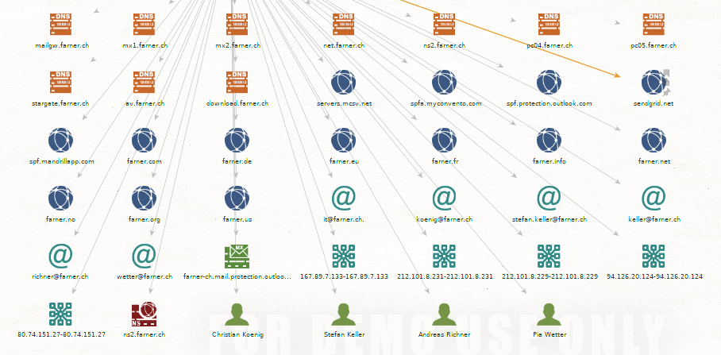

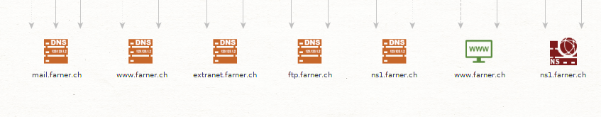

On peut voir plusieurs domaine actif, notamment un serveur FTP sur l'adresse ftp.farner.ch ainsi que le site internet de l'entreprise.

On voit aussi plusieurs employés de l'entreprise, on peut aller verifier cette information sur le site de l'entreprise directement: https://www.farner.ch/fr/equipe/andreasrichner/

En appliquant les transformations sur l'employé "Christian Koenig", on obtient toute une série d'adresse mail et de clé PGP

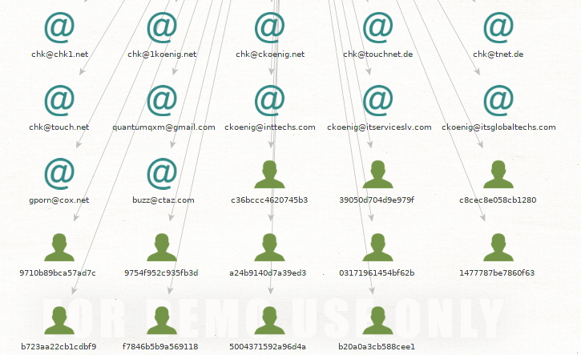

Malheuresement ces e-mails/clés PGP semble être des faux positifs.

J'ai donc testé avec un domaine plus grand, celui de l'epfl (epfl.ch), et j'ai appliqué les transformations sur le chercheur Philippe A Oechslin:

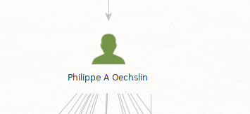

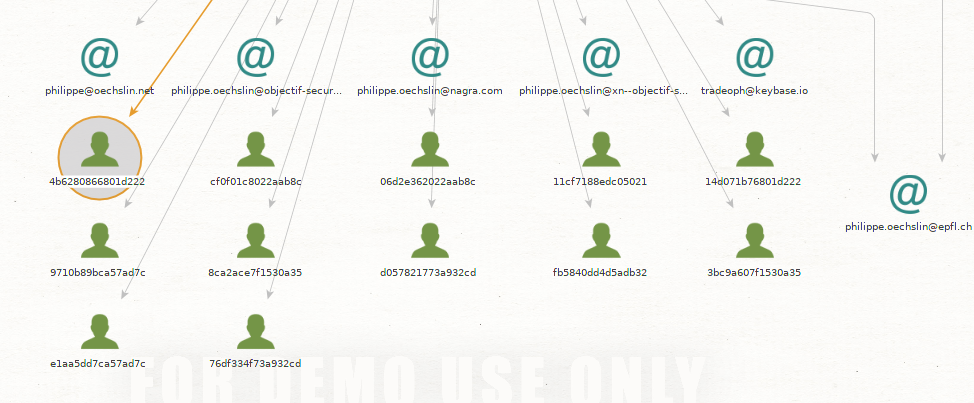

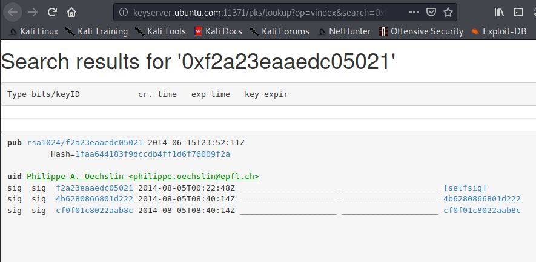

Cette fois ci les e-mails et clés PGP sont réelles.

## Recherche d'une identité

J'ai d'abord testé avec mon nom (Jérôme Bagnoud), mais je n'ai rien trouvé.

J'ai testé pas mal de personnes (des proches, des membres d'entreprise diverses), mais je n'ai rien trouvé, j'ai donc opté pour une "personnalité publique": Julian Assange

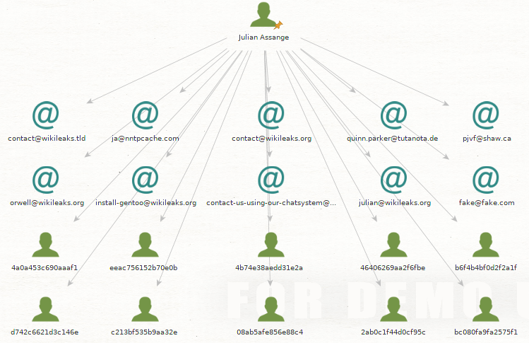

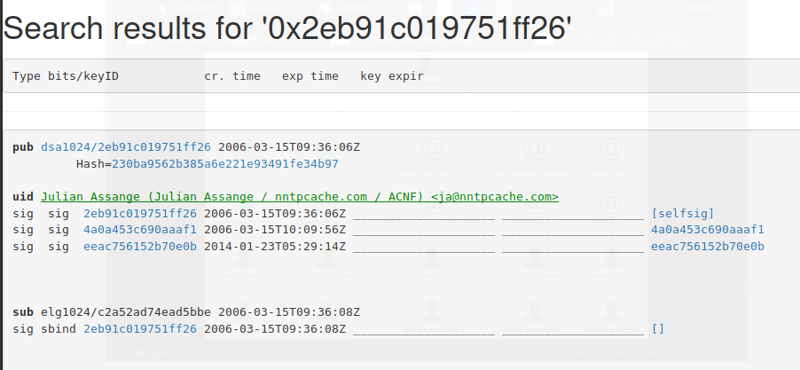

Et la encore on trouve les diverses adresses mail (notament du domaine wikileaks, ce qui est légitime) ainsi que des clés PGP.

## Recherche d'une adresse email

J'ai essayé cette lsite d'adresse mail:

1) jerome.bagnoud@heig-vd.ch
2) lapinousexy@gmail.com
3) divers adresses venant de mon projet d'AST

Mais aucune n'ont donné de résultat concluant.

## Installation et utilisation de nouvelles transformations

Après avoir installé les trois transformations je vais relancer les recherches:

### Domaine

Je reprends le domaine farner.ch:

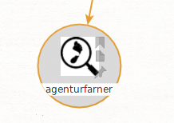

On peut par exemple voir un nouvel élément intéressant qui est un id YouTube (agenturfarner). Si on le rentre dans la barre de recherche de YouTube, on découvre la chaîne YouTube de l'entreprise Farner Consulting AG: https://www.youtube.com/channel/UCklqKEAz1hWTJ5MbLA26Viw

On a aussi un compte Instagram:

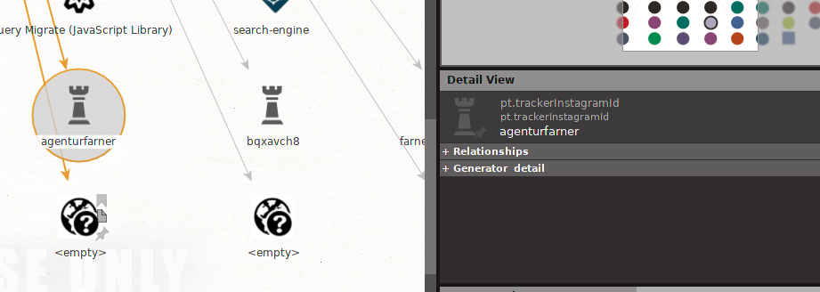

Qui, quand on va le voir (https://www.instagram.com/agenturfarner/) est bien celui de l'entreprise en question:

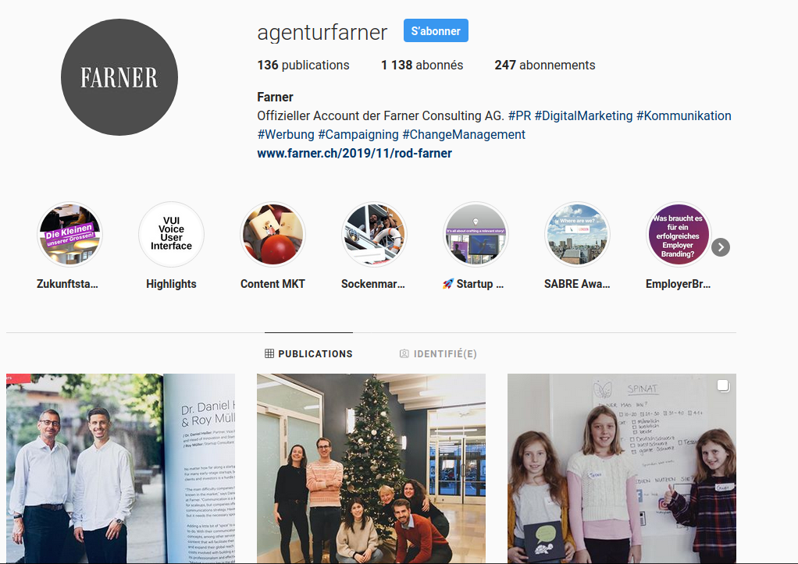

On peut aussi voir des informations sur le serveur WEB directement: 

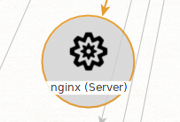

On peut vérifier cette information en regardant les headers HTTP du site:

Le serveur WEB tourne bien avec nginx (en tout cas si on en croit les headers...).

En rescannant le domaine de l'EPFL (epfl.ch), on peut voir des fichiers malicieux en rapport avec ce domaine:

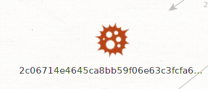

En cherchant le domaine de l'EPFL sur VirusTotal, on voit que ces fichiers sont en rapport avec l'EPFL car il communique avec le domaine de l'EPFL (peut-être ce sont des tests d'étudiants ou des recherches de certain professeurs).

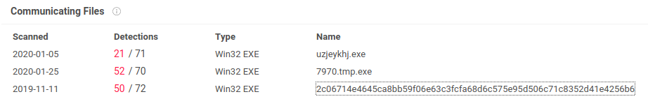

En faisant les transform Shodan sur les adresses IP trouvées (128.178.222.69), on peut voir les services qui tourne sur cette adresse, ici on voit le port 443 (https) et 80 (http):

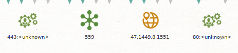

## Et maintenant ?

J'ai installé la transform "Have I Been Pwned", et j'ai fait les transform sur les adresses e-mail de "Bastien Gardel" à partir du domaine de la HEIG-VD (heig-vd.ch):

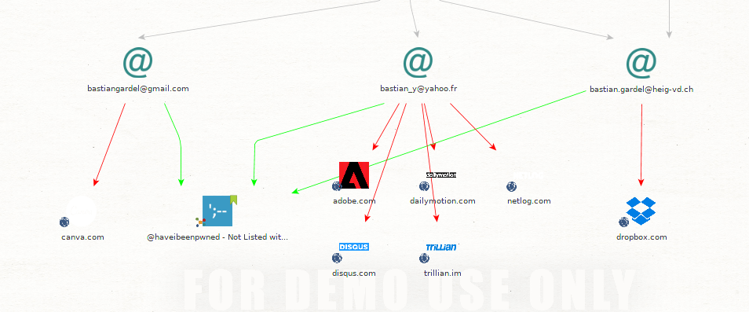

On peut voir que ses adresses mail se sont retrouvées dans plusieurs fuites de donnée, notamment sur le site dropbox.com, ce qui indique qu'il est possible de retrouver des hash de ses anciens mot de passe, ou peut-être des anciens mot de passe en clair.

J'ai ensuite essayé de trouver des informations à partir d'un de mes pseudos (lapinousexy):

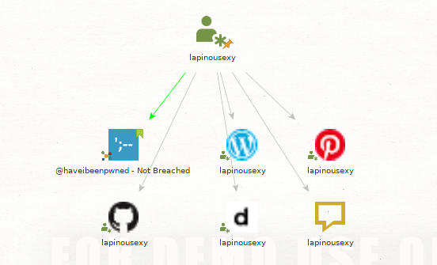

On peut trouver mon compte GitHub, Dailymotion, mais aussi d'autres comptes qui ne m'appartiennent pas (Pinterest et Wordpress).

**Est-ce que le graph devient difficile à gérer ?**

Oui il devient complexe, surtout si on rajoute beaucoup de transform ou si le domaine est très grand (epfl.ch), mais on sent que les developpeurs de Maltego on fait un effort pour le rendre le plus lisible possible, notamment en réorganisant la structure si de nouvelles informations s'ajoutent au graph, afin de garder une bonne visibilité.
